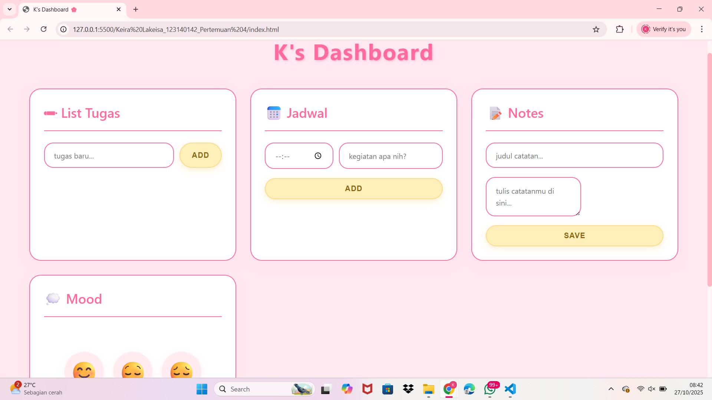

# Personal Dashboard - K's Dashboard

## Deskripsi
Aplikasi personal dashboard untuk mengelola tugas, jadwal, catatan, dan mood harian dengan tampilan minimalis pink-kuning pastel.

## Fitur Aplikasi
- **List Tugas**: Tambah, tandai selesai, dan hapus tugas harian
- **Jadwal**: Atur jadwal dengan waktu spesifik
- **Notes**: Buat catatan dengan judul dan isi
- **Mood Tracker**: Catat perasaan harian dengan emoji

## Screenshot


## Fitur ES6+ yang Diimplementasikan

### 1. Let dan Const
Digunakan untuk semua deklarasi variabel dengan scope yang tepat.

### 2. Arrow Functions
```javascript
loadFromStorage = (key) => {
    const data = localStorage.getItem(key);
    return data ? JSON.parse(data) : null;
}
```

### 3. Template Literals
```javascript
taskList.innerHTML = this.tasks.map(task => `
    <li class="task-item ${task.completed ? 'completed' : ''}">
        <div class="task-text">${task.text}</div>
    </li>
`).join('');
```

### 4. Classes
- TaskManager - Mengelola list tugas
- ScheduleManager - Mengelola jadwal
- NoteManager - Mengelola catatan
- MoodTracker - Mengelola mood harian

### 5. Async/Await
```javascript
const initDashboard = async () => {
    const greeting = await updateGreeting();
};
```

### 6. Destructuring & Spread Operator
```javascript
this.tasks = this.tasks.map(task => 
    task.id === id ? { ...task, completed: !task.completed } : task
);
```

### 7. Higher-Order Functions
- `.map()` untuk render list
- `.filter()` untuk delete items
- `.sort()` untuk sorting jadwal berdasarkan waktu

### 8. localStorage
Semua data (tasks, schedules, notes, mood) tersimpan otomatis di localStorage browser sehingga data tidak hilang saat refresh.

## Cara Menjalankan
1. Download atau clone repository ini
2. Buka file `index.html` di browser
3. Mulai tambahkan tugas, jadwal, dan catatan!

## Teknologi
- HTML5
- CSS3
- JavaScript ES6+
- localStorage API

---
**Nama**: Keira Lakeisha Fachra Fuady  
**NIM**: 123140142 
**Pertemuan**: 4 - JavaScript Next Gen