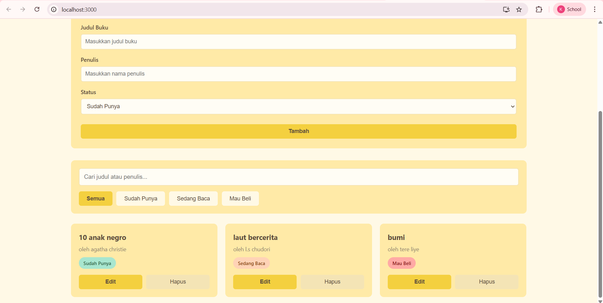
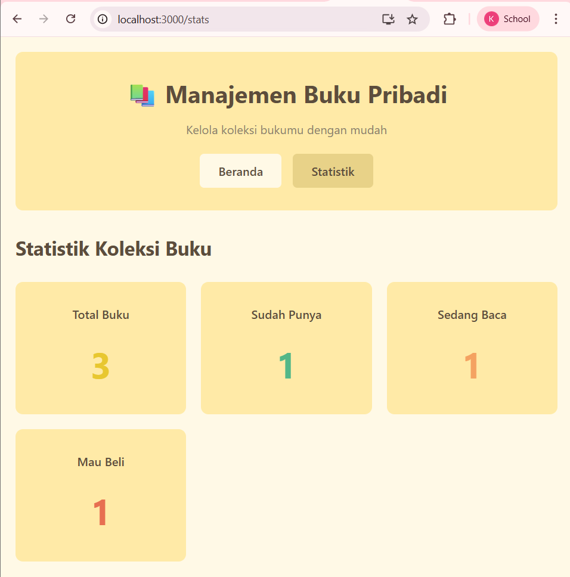
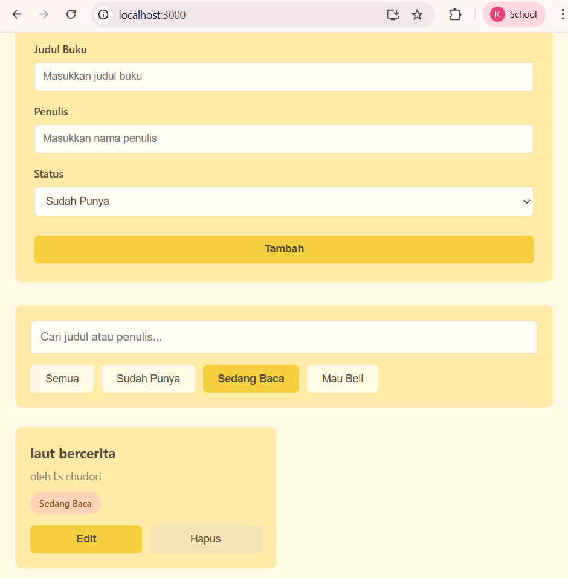
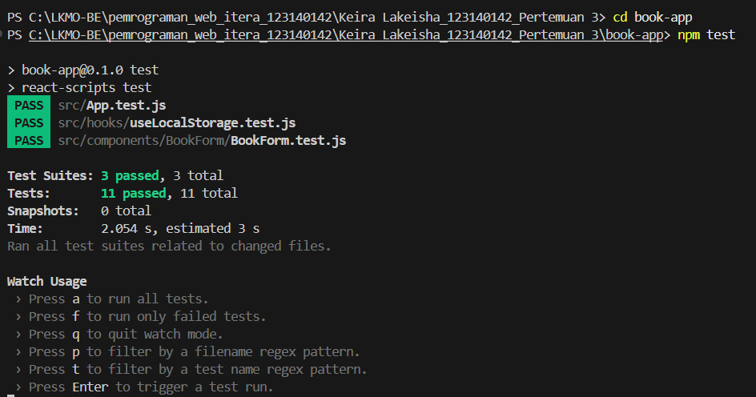

# Aplikasi Manajemen Buku Pribadi

Aplikasi web untuk mengelola koleksi buku pribadi dengan mudah. Dibuat menggunakan React dengan desain minimalis warna kuning pastel.

## Fitur Utama

- Tambah, edit, dan hapus buku
- Pencarian buku berdasarkan judul atau penulis
- Filter buku berdasarkan status (Sudah Punya, Sedang Baca, Mau Beli)
- Statistik koleksi buku
- Penyimpanan otomatis menggunakan localStorage
- Responsive design

## Teknologi yang Digunakan

- React 18 - Library JavaScript untuk membangun UI
- React Router - Navigasi multi-halaman
- Context API - State management global
- localStorage - Penyimpanan data lokal
- Jest & React Testing Library - Unit testing

## Instalasi

1. Clone repository ini
```bash
git clone [URL_REPOSITORY]
cd [NAMA_FOLDER]
cd book-app
```

2. Install dependencies
```bash
npm install
```

3. Jalankan aplikasi
```bash
npm start
```

Aplikasi akan berjalan di http://localhost:3000

## Menjalankan Testing

Jalankan semua test:
```bash
npm test
```

Jalankan test dengan coverage:
```bash
npm test -- --coverage
```

## Struktur Folder
```
src/
├── components/          # Komponen reusable
│   ├── BookForm/       # Form tambah/edit buku
│   ├── BookList/       # Daftar buku
│   └── BookFilter/     # Filter dan pencarian
├── pages/              # Halaman aplikasi
│   ├── Home/          # Halaman utama
│   └── Stats/         # Halaman statistik
├── hooks/              # Custom hooks
│   ├── useLocalStorage.js
│   └── useBookStats.js
├── context/            # Context API
│   └── BookContext.js
├── App.js             # Komponen utama
└── index.js           # Entry point
```

## Fitur React yang Diimplementasikan

### 1. Functional Components
Semua komponen dibuat menggunakan functional components

### 2. Hooks
- useState - Mengelola state lokal
- useEffect - Side effects dan lifecycle
- useContext - Mengakses global state

### 3. Custom Hooks
- useLocalStorage - Menyimpan data ke localStorage
- useBookStats - Menghitung statistik buku

### 4. Context API
BookContext untuk state management global yang menyimpan:
- Daftar buku
- Filter status
- Query pencarian
- Fungsi CRUD

### 5. React Router
Navigasi antar halaman:
- / - Halaman utama (manajemen buku)
- /stats - Halaman statistik

### 6. Controlled Components
Semua form input dikelola sebagai controlled components

### 7. Conditional Rendering
- Tampilan kosong saat belum ada buku
- Mode edit vs tambah buku
- Tombol batal saat edit

### 8. List Rendering & Keys
Render daftar buku dengan unique key (id)

### 9. Event Handling
- Form submission
- Button clicks
- Input changes

## Screenshot

### Halaman Utama


Halaman utama dengan form tambah buku dan daftar buku

### Halaman Statistik


Statistik koleksi buku berdasarkan status

### Filter & Pencarian


Fitur filter dan pencarian buku

## Testing

Aplikasi ini dilengkapi dengan unit testing untuk:

1. BookForm Component
   - Render form fields
   - Validasi input
   - Submit form
   - Edit mode

2. useLocalStorage Hook
   - Save data
   - Load data
   - Handle arrays dan objects

Total 11 test cases yang mencakup komponen dan custom hooks.

### Screenshot Hasil Testing


## Desain

Aplikasi menggunakan desain minimalis dengan palet warna kuning pastel:
- Background: #FFF9E6 (Cream)
- Primary: #FFEAA7 (Yellow Pastel)
- Accent: #F4D03F (Golden Yellow)
- Text: #5C4D3C (Brown)

## Cara Penggunaan

1. Menambah Buku
   - Isi form dengan judul, penulis, dan status buku
   - Klik tombol "Tambah"

2. Edit Buku
   - Klik tombol "Edit" pada buku yang ingin diubah
   - Form akan terisi otomatis
   - Update data dan klik "Update"

3. Hapus Buku
   - Klik tombol "Hapus" pada buku yang ingin dihapus
   - Konfirmasi penghapusan

4. Filter Buku
   - Gunakan tombol filter untuk melihat buku berdasarkan status
   - Atau gunakan search box untuk mencari buku

5. Lihat Statistik
   - Klik menu "Statistik" untuk melihat ringkasan koleksi

## Developer

Nama: Keira Lakeisha Fachra Fuady
NIM: 123140142
Mata Kuliah: Pemrograman Aplikasi Web

## Lisensi

Project ini dibuat untuk keperluan praktikum.