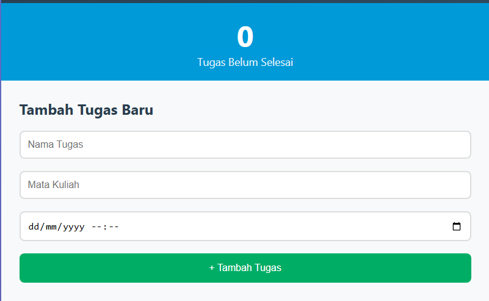

# TaskMaster - Aplikasi Manajemen Tugas Mahasiswa

## Deskripsi Aplikasi
TaskMaster merupakan aplikasi web untuk manajemen tugas akademik mahasiswa. Aplikasi ini memungkinkan pengguna untuk mengorganisir tugas kuliah dengan fitur-fitur dasar yang essensial dan antarmuka yang user-friendly.

## Fitur yang Diimplementasikan
- **Manajemen Tugas**: Menambah, mengedit, menandai selesai, dan menghapus tugas
- **Informasi Tugas**: Nama tugas, mata kuliah, dan deadline
- **Filter dan Pencarian**: Filter berdasarkan status penyelesaian dan mata kuliah
- **Statistik**: Menampilkan jumlah tugas yang belum selesai
- **Validasi Form**: Memastikan data input valid sebelum disimpan
- **Penyimpanan Lokal**: Data tersimpan secara persisten menggunakan localStorage

## Screenshot Aplikasi

### 1. Tampilan Utama dengan Dashboard

*Halaman utama aplikasi dengan form input dan statistik tugas*

### 2. Form Input dengan Validasi

*Form tambah tugas dengan sistem validasi real-time*

### 3. Daftar Tugas dengan Filter

*Interface daftar tugas dengan fitur filter dan pencarian*

## Panduan Menjalankan Aplikasi

### Persyaratan Sistem
- Web browser modern (Chrome, Firefox, Safari, atau Edge)
- JavaScript enabled
- LocalStorage support

### Langkah-langkah
1. Download seluruh file dalam folder version1
2. Buka file `index.html` menggunakan web browser
3. Aplikasi siap digunakan tanpa perlu instalasi tambahan

### Cara Penggunaan
1. **Menambah Tugas**: Isi form "Tambah Tugas Baru" dan klik tombol submit
2. **Mengubah Status**: Klik tombol "Selesai" untuk menandai tugas completed
3. **Menghapus Tugas**: Klik tombol "Hapus" dan konfirmasi penghapusan
4. **Memfilter Tugas**: Gunakan dropdown filter dan search box untuk mencari tugas tertentu

## Aspek Teknis

### Implementasi LocalStorage
Aplikasi menggunakan Web Storage API untuk penyimpanan data lokal:

```javascript
localStorage.setItem('tasks', JSON.stringify(tasksArray));

const tasks = JSON.parse(localStorage.getItem('tasks')) || [];
```

**Karakteristik Penyimpanan:**
- Data disimpan dalam format JSON
- Penyimpanan otomatis pada setiap perubahan
- Data persisten meskipun browser ditutup
- Kapasitas penyimpanan mengikuti limit browser

### Sistem Validasi Form
Validasi dilakukan untuk memastikan integritas data:

```javascript
function validateForm(taskName, course, deadline) {
    if (!taskName.trim()) return false;
    if (!course.trim()) return false;
    if (!deadline) return false;
    
    if (new Date(deadline) < new Date()) return false;
    
    return true;
}
```

**Aturan Validasi:**
1. Nama tugas harus diisi
2. Mata kuliah harus diisi
3. Deadline harus diisi dan tidak boleh tanggal masa lalu

### Struktur Data
```javascript
{
    id: Number,           // Identifier unik
    name: String,         // Nama tugas
    course: String,       // Mata kuliah
    deadline: String,     // Tanggal deadline
    completed: Boolean,   // Status penyelesaian
    createdAt: String     // Waktu pembuatan
}
```

## Identitas Pembuat
**Nama**: Keira Lakeisha Fachra Fuady  
**NIM**: 123140142  
**Kelas**: RA


```
